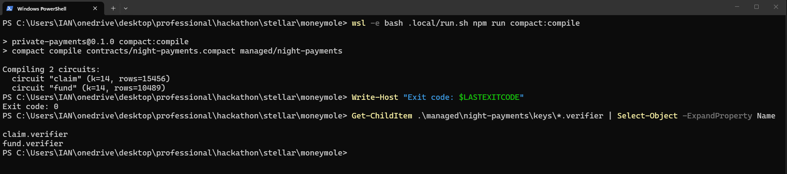
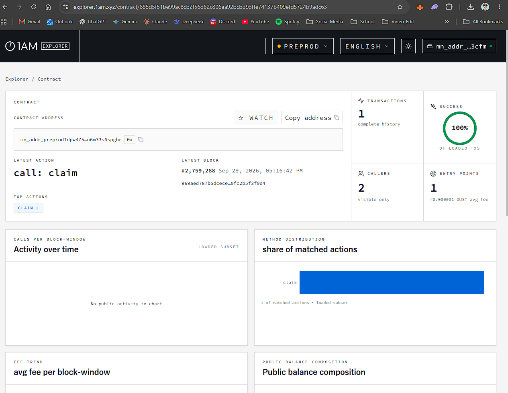
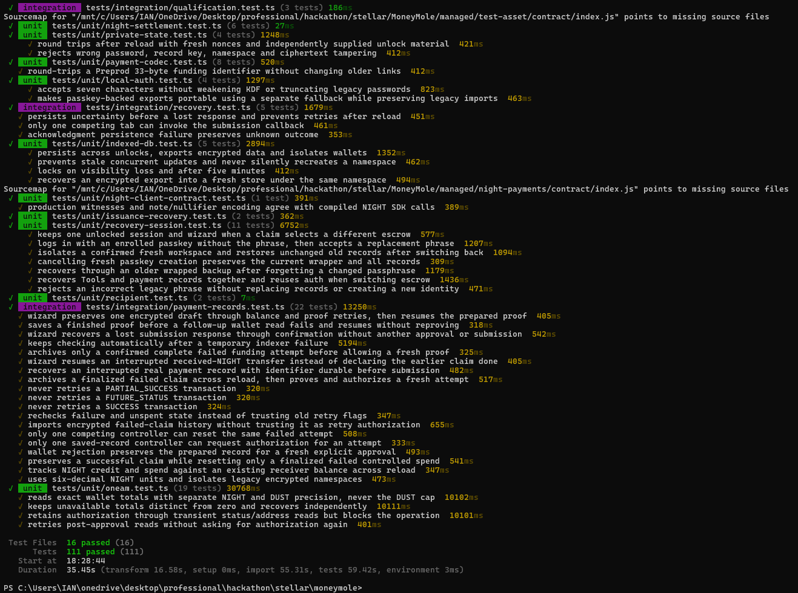

# MoneyMole

[](https://github.com/ianpurif/MoneyMole/actions/workflows/ci.yml)

**Sender-funded native NIGHT payment links on Midnight Preprod, using 1AM.**
Wallet A escrows NIGHT, shares a bearer link or local QR, and independent Wallet B
claims the same NIGHT. DUST pays transaction fees only. No custom token, mint on
claim, wrapping, exchange rate or mainnet money is involved.

## What This Product Does

The product idea is a funded payment capability: a client deposits NIGHT and sends
its claim to a freelancer, who can redeem without the sender being online. NIGHT
amounts and addresses are public. The private part is bearer authorization and
client-side recovery, not anonymous or shielded value transfer. Anyone with the
link, including its sender, can claim. There is no expiry or refund.

## Contract Address

The owner changed the payment asset from the historical shielded test token to
native NIGHT on 2026-09-27. [ADR 007](docs/adr/007-native-night-payments.md) records
the compatibility and disclosure changes. The current contract is
[night-payments.compact](contracts/night-payments.compact). Its constructor fixes
nativeToken(), fund uses receiveUnshielded and claim uses sendUnshielded. Amounts
use integer STAR: **1 NIGHT = 1,000,000 STAR**, with six decimal places in the UI.

The verified Preprod NIGHT escrow is
`685d5f51be99ac8cb2f56d82c806aa92bcbd93ffe74137b409efd5724b9adc63`.
Its [public deployment record](deployments/preprod/night-payment-escrow.json)
identifies transaction
`0043457907ca3523d4aa6e1a570a2ecf5d0a5239f2a456d736442b10be9e660544`.
Read-only checks found the finalized deployment, matching fund/claim verifier keys,
two successful native NIGHT funding calls and one successful claim call. The app
selects this escrow by default; a wallet's saved escrow choice or a claim link can
select another compatible, independently verified escrow.

| Network | Payment contract | Deployment transaction ID |
|---|---|---|
| Preprod | `685d5f51be99ac8cb2f56d82c806aa92bcbd93ffe74137b409efd5724b9adc63` | `0043457907ca3523d4aa6e1a570a2ecf5d0a5239f2a456d736442b10be9e660544` |

## Live Demo

[Hosted MoneyMole app](https://moneymole.vercel.app/) ·
[Product X profile](https://x.com/moneymolepay) ·
[Owner-supplied demo video](https://drive.google.com/file/d/13UA_JUO9VrcOQFvnCMzpRd1Z_H6BUKVl/view?usp=sharing) ·
[Public repository](https://github.com/ianpurif/MoneyMole)

These pages returned HTTP 200 on 2026-09-29. That establishes reachable links,
not a working hosted payment: the browser still needs an approved 1AM wallet,
Preprod NIGHT/DUST and a trusted proof server. The video's duration and depicted
wallet/chain actions have not been independently reviewed. The three supplied
[compile](docs/evidence/images/compile.png),
[contract](docs/evidence/images/contract.png) and
[test](docs/evidence/images/test-ss.png) screenshots were visually inspected and
are committed as public evidence. The owner-supplied CSV remains local and
untracked. With the owner's statement that respondents consented to public
disclosure, [USERS.md](USERS.md) now lists their submitted wallet strings and
[FEEDBACK.md](docs/FEEDBACK.md) lists names, emails and feedback in the
organizer's four-column raw log; each email appears in the User cell.

## Current evidence and limits

Local checks and actual wallet acceptance are separate. See [current status](docs/STATUS.md)
and [wallet/card verification](docs/evidence/wallet-card-verification.json). Synthetic
contract/proving/integration/browser tests never establish a real Preprod payment.
The current revision fixes temporary-read disconnects, retains 1AM authorization
across client navigation, and uses a centered, fixed-height wallet card with internal
scrolling. Full reloads still need an explicit **Connect Wallet** action because connector v4
has no passive restore API. Private records retain their separate automatic lock.

[Run 36560770680](https://github.com/ianpurif/MoneyMole/actions/runs/36560770680)
**passed** for published commit `f30cfbb`, including Compact artifacts, the
evidence ledger, lint, typecheck, deterministic/contract/integration suites,
production build and browser security/synthetic authorization. It does not
establish owner-wallet payment acceptance. Local build,
proving, browser connectivity and read-only deployment
checks passed in [the scoped verification record](docs/evidence/night-escrow-verification.json).
Independent-wallet credit/spend/recovery and private-link delivery still require
owner-observed evidence. Public chain calls do not prove who controlled either
wallet or make native NIGHT amounts private. See [usage and origin recovery](docs/USAGE.md).

The retained issuer at
`47f3f2f299d79608cf8c0048e775391428d903ab2c7ef054f42ac294df366635`
and deployment identifier
`003664b95a34f2596809d49982819f3f1e38347d5fe444a13c199bdcae03757886`
are **historical test-token evidence, not a NIGHT escrow**. Its original
[record](deployments/preprod/test-asset-issuer.json), source and read-only verifier
remain intact. Do not redeploy or issue that asset for NIGHT testing.

## Level 1 Evidence

| Requirement | Direct evidence and remaining limit |
|---|---|
| Toolchain and successful `compact compile` | [Pinned tools](docs/TOOLCHAIN.md), [exact command](docs/RUNBOOK.md), [current Compact source](contracts/night-payments.compact) and [scoped local verification](docs/evidence/night-escrow-verification.json). The [compile screenshot](docs/evidence/images/compile.png) shows `claim` and `fund`, exit 0. |
| Passing test suite | [Contract tests](tests/contracts/night-runtime.mjs), [integration tests](tests/integration/payment-records.test.ts) and [verification record](docs/evidence/night-escrow-verification.json). The [test screenshot](docs/evidence/images/test-ss.png) shows 111 passing Vitest tests at capture time; this is local/synthetic evidence, not live payment acceptance. |
| Generated `managed/` circuits and keys | `npm run compile:contracts && npm run verify:artifacts`; [artifact instructions](managed/README.md). Generated `managed/night-payments/` contains fund/claim material locally and in CI, but is intentionally ignored by Git. |
| Deployed contract and visible address | Preprod escrow `685d5f51be99ac8cb2f56d82c806aa92bcbd93ffe74137b409efd5724b9adc63`: [deployment record](deployments/preprod/night-payment-escrow.json), [finality check](docs/evidence/native-night-level-verification.json), [1AM Explorer](https://explorer.1am.xyz/contract/685d5f51be99ac8cb2f56d82c806aa92bcbd93ffe74137b409efd5724b9adc63) and [Explorer screenshot](docs/evidence/images/contract.png). The screenshot shows the contract page, not the full deployment transaction. |
| Initial product idea | [What This Product Does](#what-this-product-does) is the one-paragraph idea. |
| At least 5 meaningful commits | [Commit audit](docs/evidence/commit-audit.json) reviewed 35 substantive published commits on an earlier head; inspect [public history](https://github.com/ianpurif/MoneyMole/commits/main/). |
| Public README and local setup | [Public repository](https://github.com/ianpurif/MoneyMole), this README and [Setup](#setup). |
| Compile, deployment and test screenshots | [Compile](docs/evidence/images/compile.png), [contract page](docs/evidence/images/contract.png) and [tests](docs/evidence/images/test-ss.png) are committed. The contract screenshot does not show the deployment transaction; use the record above for that identifier. |
| Public state versus private witness | [Privacy Model](#privacy-model) and [disclosure audit](docs/disclosure-audit.md) distinguish public NIGHT metadata/commitments from private bearer authority and nonce. |





## Level 2 Evidence

| Requirement | Evidence and status |
|---|---|
| Lace connect/disconnect requirement | The [wallet picker](src/components/wallet-connect-modal.tsx) and [adapter](src/lib/midnight/oneam.ts) offer explicit connect/disconnect; **1AM is the primary wallet**. Owner reports 1AM may substitute for Lace, but organizer acceptance and real extension behavior are unverified. |
| Frontend circuit call | [Payment controller](src/lib/midnight/payments.ts) invokes `fund`/`claim`; [read-only chain evidence](docs/evidence/native-night-level-verification.json) shows two successful funds and one claim. Their MoneyMole frontend/wallet origin is unverified. |
| Observable privacy behavior | [Compact source](contracts/night-payments.compact), [privacy explanation](docs/PRIVACY.md) and [disclosure audit](docs/disclosure-audit.md) show private bearer authority and public commitment/nullifier. Real-wallet transcript review remains pending; NIGHT amounts/addresses are public. |
| Preprod contract address | [Deployment record](deployments/preprod/night-payment-escrow.json) and [1AM Explorer](https://explorer.1am.xyz/contract/685d5f51be99ac8cb2f56d82c806aa92bcbd93ffe74137b409efd5724b9adc63). |
| At least 8 meaningful commits | [35-commit audit](docs/evidence/commit-audit.json), bound to an earlier published head. |
| Public README and live demo link | [Repository](https://github.com/ianpurif/MoneyMole) and [hosted app](https://moneymole.vercel.app/) are reachable; full hosted 1AM/prover/payment flow is unverified. |
| Wallet/circuit demo video | [Owner-supplied video page](https://drive.google.com/file/d/13UA_JUO9VrcOQFvnCMzpRd1Z_H6BUKVl/view?usp=sharing) is reachable; its content has not been reviewed against this criterion. |

## Level 3 Evidence

| Requirement | Evidence and status |
|---|---|
| Functional privacy dApp | [Send/claim controller](src/lib/midnight/payments.ts), [architecture](docs/ARCHITECTURE.md) and [acceptance matrix](docs/TESTING.md) show implemented flow. Independent-wallet credit/spend, replay, recovery and live disclosure acceptance remain pending. |
| At least 3 passing tests | [Local verification](docs/evidence/night-escrow-verification.json) and [test screenshot](docs/evidence/images/test-ss.png) (111 passing tests at capture). |
| CI/CD workflow and passing run | [Workflow](.github/workflows/ci.yml) and [passed run 36560770680](https://github.com/ianpurif/MoneyMole/actions/runs/36560770680) for `f30cfbb`; synthetic CI is separate from owner-wallet acceptance. |
| Approved idea from provided list | [Payment proposal](PROPOSAL.md) is a draft. Idea-list submission and organizer approval are **not evidenced**. |
| At least 10 meaningful commits | [35-commit audit](docs/evidence/commit-audit.json), bound to an earlier published head. |
| Public README and live URL | [Repository](https://github.com/ianpurif/MoneyMole), [hosted app](https://moneymole.vercel.app/) and [Setup](#setup); hosted payment acceptance unverified. |
| Test-output screenshot | [Public test screenshot](docs/evidence/images/test-ss.png), visually reviewed at its stated local/synthetic scope. |
| One-minute full-function video | [Owner-supplied video](https://drive.google.com/file/d/13UA_JUO9VrcOQFvnCMzpRd1Z_H6BUKVl/view?usp=sharing) is reachable; duration and full flow unreviewed. |
| Observer privacy explanation | [Privacy Model](#privacy-model) says what is visible and what remains client-side. |



## Level 4 Evidence

| Requirement | Evidence and status |
|---|---|
| Working Preprod MVP and address | [Verified escrow](deployments/preprod/night-payment-escrow.json) and [observed fund/claim IDs](docs/evidence/native-night-level-verification.json) prove contract activity. The full independent Wallet A→B app flow remains unverified. |
| README, setup and usage | This README, [Setup](#setup), [USAGE](docs/USAGE.md) and [RUNBOOK](docs/RUNBOOK.md). |
| Product-repo CI | [Workflow](.github/workflows/ci.yml) and [passed run 36560770680](https://github.com/ianpurif/MoneyMole/actions/runs/36560770680) for `f30cfbb`. |
| Product X profile | [@moneymolepay](https://x.com/moneymolepay) returned a page titled “MoneyMole (@moneymolepay) / X”; account control/content is not independently established. |
| At least 15 meaningful commits | [35-commit audit](docs/evidence/commit-audit.json), bound to an earlier published head. |
| Hosted demo and MVP video | [Hosted app](https://moneymole.vercel.app/) and [owner-supplied video](https://drive.google.com/file/d/13UA_JUO9VrcOQFvnCMzpRd1Z_H6BUKVl/view?usp=sharing) are reachable; complete live flow and video content remain unreviewed. |

## Level 5 Evidence

| Requirement | Evidence and status |
|---|---|
| Same MVP extended | [Architecture](docs/ARCHITECTURE.md) and [USAGE](docs/USAGE.md) describe NIGHT recovery, retries, QR and receipts; live Level 4 acceptance still carries forward. |
| 50 verifiable Preprod users and wallet-address list | [USERS.md](USERS.md) now lists 70 distinct owner-supplied Preprod-formatted wallet strings with form dates. The owner reports public-disclosure consent. Chain activity, wallet control, MoneyMole use and unique people remain unverified; **50 verified users are not claimed**. |
| Feedback loop | [FEEDBACK.md](docs/FEEDBACK.md) now contains the 70 owner-supplied names, emails and feedback entries in the organizer's raw-log format. Reviewed themes and feedback-to-change commit links remain pending. |
| Updated documentation | [USAGE](docs/USAGE.md), [PRIVACY](docs/PRIVACY.md) and [current audit](docs/LEVEL-AUDIT.md). |
| At least 20 meaningful commits | [35-commit audit](docs/evidence/commit-audit.json), bound to an earlier published head. |
| Live link and full-MVP video | [Hosted app](https://moneymole.vercel.app/) and [owner-supplied video](https://drive.google.com/file/d/13UA_JUO9VrcOQFvnCMzpRd1Z_H6BUKVl/view?usp=sharing) are reachable; functional content remains unverified. |

## Level 6 Evidence

| Requirement | Evidence and status |
|---|---|
| Same MVP extended | [Architecture](docs/ARCHITECTURE.md) and [USAGE](docs/USAGE.md); independent-wallet acceptance is still pending. |
| 70 verifiable Preprod users and wallet-address list | [USERS.md](USERS.md) publishes 70 submitted Preprod-formatted strings; [LAUNCH_USERS.md](LAUNCH_USERS.md) records the Level 6 qualification gap. They are **not 70 verified users** without independent chain, wallet and person-level evidence. Respondent emails appear in [FEEDBACK.md](docs/FEEDBACK.md). |
| Feedback loop and updated documentation | [FEEDBACK.md](docs/FEEDBACK.md) distinguishes collected raw responses from reviewed themes and shipped changes; [USAGE](docs/USAGE.md), [PRIVACY](docs/PRIVACY.md) and [audit](docs/LEVEL-AUDIT.md) are current technical docs. |
| At least 20 meaningful commits; stricter checklist asks for 30 | [35 substantive published commits reviewed](docs/evidence/commit-audit.json) on an earlier head; inspect [public history](https://github.com/ianpurif/MoneyMole/commits/main/). |
| Public repository, live link and full-MVP video | [Repository](https://github.com/ianpurif/MoneyMole), [hosted app](https://moneymole.vercel.app/) and [video page](https://drive.google.com/file/d/13UA_JUO9VrcOQFvnCMzpRd1Z_H6BUKVl/view?usp=sharing) are reachable; end-to-end content is not independently validated. |
| Level 6 network/user rubric | Supplied checklist specifies **70 total Preprod users**; [Rise In public page](https://www.risein.com/programs/new-moon-to-full-monthly-moonshots-on-midnight) describes **Mainnet launch and 20 real users**. [Scope note](docs/LEVEL-AUDIT-SCOPE.md) records the conflict. There is no claimed Mainnet deployment or organizer ruling. |

The [detailed current audit](docs/LEVEL-AUDIT.md) separates implementation, live
chain observation, owner evidence and missing submission items. The pasted detailed
checklist is recorded in [LEVEL-AUDIT-SCOPE](docs/LEVEL-AUDIT-SCOPE.md); Rise In's
public [program page](https://www.risein.com/programs/new-moon-to-full-monthly-moonshots-on-midnight)
confirms the six-stage journey but differs on Level 6. The generated
[REQUIREMENTS.md](docs/REQUIREMENTS.md) tracks source-bound engineering evidence;
its older Level audit snapshot is historical. Neither local proofs nor public NIGHT
calls establish hidden-amount privacy or organizer eligibility.

## Tech Stack

Next.js App Router, TypeScript, Tailwind CSS, Midnight Compact/Midnight.js,
supported browser wallet connectors and a trusted loopback proof server. The
browser owns wallet authorization, witnesses and encrypted local records; the
Next.js server exposes only public application resources. See [architecture](docs/ARCHITECTURE.md).

## Setup

Linux/WSL2 is the target. Use **Node 22.16.0**, **npm 10.9.2**, Compact compiler
**0.31.1**, Docker Desktop/Engine and the pinned proof server **8.1.0**. Windows
compact.exe is a filesystem tool, not the Midnight compiler. Use a single Linux
node_modules tree and the committed npm lockfile.

```sh
npm ci --no-audit --no-fund
node scripts/install-compact.mjs --approve-reviewed-installer
export PATH="$PWD/.local/compact/bin:$PATH"
export COMPACT_DIRECTORY="$PWD/.local/compact/artifacts"
npm run compile:contracts
npm run compile:legacy
npm run compile:issuance
npm run verify:artifacts
npm run services:up
npm run test:proving
npm run build
npm run start
```

The installer command explicitly executes the repository-reviewed pinned installer;
inspect scripts/install-compact.mjs on a new host. Legacy compiles preserve historical
identities and regression coverage; they do not issue anything. generated managed/
code and keys are reproducible ignored artifacts, not fabricated checked-in output.
Keep the final app process running and open http://localhost:3000. Stop the app
before rebuilding. The proof server listens at http://127.0.0.1:6300.

On the already configured Windows host, prefix each npm command with
`wsl --exec bash .local/run.sh` in PowerShell. That ignored launcher is local host
setup, not part of a fresh clone. [OWNER-TESTING.md](docs/OWNER-TESTING.md) gives the
complete sequential manual flow and troubleshooting.

## Configuration and storage

| Location | Meaning |
|---|---|
| .env.local | Public `PROOF_SERVER_PORT=6300` Compose setting; never wallet credentials |
| [config/preprod.json](config/preprod.json) | Reviewed indexer/RPC/prover endpoints, default verified NIGHT escrow, NIGHT/unshielded/6 decimals/v2 metadata; historical issuer fields retained only for legacy verification |
| Browser localStorage | Wallet-scoped public escrow selection, `moneymole/escrow/v3/<localIdentity>`; legacy `moneymole/night-escrow/v2` remains readable |
| Encrypted IndexedDB | Wallet/contract/network/schema-v2 payment and deployment records; passphrase-derived keys never saved |
| Public deployment export | The committed default record is under deployments/preprod/; any new owner-approved escrow export can be saved separately and verified with `--record <path>` |
| Encrypted exports | Private payment and escrow recovery; keep outside Git and never send to an agent |
| deployments/preprod/test-asset-issuer.json | Original issuer record, not current NIGHT configuration |

The verified default NIGHT escrow is in config/preprod.json, not an environment
secret. An owner may deploy/reuse a
compatible escrow; multiple senders can share one. Claims bind the specific
address in their link. The browser validates its verifier keys and native asset.
Changing a public prover endpoint requires the reviewed config/CSP and Compose
port to agree. Unused NEXT_PUBLIC values do not configure payments.

## Send, claim and verify

Forgot the local recovery passphrase? Use **Login with Passkey** if a passkey was
already enrolled, then replace the passphrase in **Tools → Security**. **Forgot
recovery passphrase?** also accepts a wrapped MoneyMole backup with its export
passphrase. Without either unlock method, old encrypted records cannot be decrypted.
The confirmed **Start a new local workspace** flow preserves the old records and
authentication metadata in this browser and creates a separate empty workspace.
Use **Switch to a preserved workspace** if the original unlock material is found.
No wallet, escrow deployment or transaction is created by this reset.

1. Chrome/A and Brave/B: real independent 1AM wallets on Preprod. A holds the NIGHT
   to send; both have enough available DUST. Record NIGHT balances A0 and B0.
2. A clicks **Connect Wallet**, selects **1AM** (or detected **Lace**), and unlocks
   **MoneyMole** once with a passkey or local recovery passphrase (at least 7 characters).
   Existing users enter their original app passphrase once, then add a passkey in
   **Tools → Security**. Passkey users add a recovery passphrase for portable backups.
   The verified default escrow is already selected. Use **Tools → Create / recover a
   payment escrow** only to recover another compatible escrow or deliberately deploy
   a new one with explicit wallet approval.
3. The default verified escrow is shared across Send, Receive, Activity and Tools.
   If deliberately using another compatible escrow, select **Use escrow** first.
   In **Send**, enter **1**
   NIGHT and click **Send NIGHT**. The compact modal saves encrypted recovery, checks funds,
   and prepares the proof. Choose **Approve payment in wallet**, review in 1AM,
   and wait for confirmation in the same modal: A = A0 - 1; escrow +1.
4. The confirmed modal shows the private claim link / QR. Share with B, then close
   A's session. B opens the mm3 fragment link (scrubbed locally), unlocks, and clicks
   **Receive NIGHT**. The modal verifies and prepares the claim; B chooses
   **Approve claim in wallet** and waits for confirmation: B = B0 + 1.
5. In the confirmed receive modal, B expands **Send received NIGHT** and enters
   A's unshielded NIGHT address,
   approves the exact spend and reconciles: B = B0, A = A0, DUST fees separate.
6. Reload/unlock/reconcile, independently import encrypted recovery on another
   local origin, test rejected replay and scan the QR privately. Export sanitized
   public receipts and run the read-only deployment/native settlement verifiers.

No custom-token issuance is part of these steps. Old mm1 links are rejected and
old encrypted records stay untouched. Use historical revision 16aa745 in a separate
checkout if legacy asset recovery is ever needed; never reinterpret its units.

Close a payment modal and use **Resume payment** or **Activity → Open payment**
to continue its saved phase. Confirmation retries never submit again. A confirmed
complete failed attempt can be retried only after fresh chain checks; unknown or
partial outcomes stay at confirmation. Backups remain in Activity → Recovery & receipts.

The card displays total NIGHT and current DUST before recovery unlock, refreshing
on a visible 15-second interval, focus and transaction operations. Temporary read
failures retain the last known totals with an updating label; spending checks use
fresh wallet reads. Send contains
funding/sharing; Receive contains claims; Activity contains history, receipts and
encrypted exports. Escrow setup and encrypted imports live in Tools. See
[usage](docs/USAGE.md) for recovery and balance availability behavior.

## Privacy Model

| Data | Boundary |
|---|---|
| NIGHT amount, input/output address, contract balance, timing | Public unshielded ledger |
| Note commitment, spent nullifier, native asset, verifier | Public contract state |
| Bearer authority, nonce, membership/private witness | Browser and trusted local prover; never Next.js APIs |
| Private records | Encrypted IndexedDB; passkey or local recovery passphrase; portable exports require a fallback passphrase |
| Wallet authorization and keys | 1AM; every approval belongs to the owner |

The proof demonstrates knowledge of the note opening and single-use authority,
with a bound payout destination. It does not hide NIGHT metadata. Lost bearer
secrets and backups can mean permanent loss. Do not expose live QR codes in demos.
Unknown/partial transactions reconcile only; canonical fully failed claims/spends
can be reset without losing their history. Imported records require fresh chain
checks. Five minutes without interaction, page close, explicit lock and
account/network changes lock the shared private session.

[Architecture](docs/ARCHITECTURE.md): Next.js App Router frontend/backend,
TypeScript, Tailwind, src/app/api/**/route.ts handlers, src/lib/server/ modules.
No separate application backend. Client-only wallet/witness/recovery logic calls
the trusted local prover directly. CSP, fragment scrubbing and local QR avoid
server handling of bearer data. See [privacy](docs/PRIVACY.md) and
[disclosure audit](docs/disclosure-audit.md) for limitations.

## Run Tests

```sh
npm run check:offline
npm run doctor
npm run audit:deps
npm run lint
npm run typecheck
npm test
npm run test:contracts
npm run test:proving
npm run build
npm run test:browser
npm run requirements:check
npm run verify:connectivity
npm run verify:issuer
npm run verify:deployment
npm run test:preprod -- --manifest reports/preprod-manifest.json
```

`npm test` runs the existing unit and integration projects with Vitest's standard
reporter. `test:preprod` requires owner-reviewed NIGHT transaction records; `verify:deployment`
now defaults to the committed escrow record and is read-only. Exit 2 is blocked,
never passed. verify:issuer is read-only historical continuity. Connectivity checks
need the running app/prover. Full verify:product also requires the complete hashed
owner-reviewed [acceptance matrix](docs/TESTING.md). CI installs/compiles/tests/builds
from the locked graph; it cannot approve wallets or establish live Preprod payments.

## CI/CD and meaningful history

Meaningful local commits cover decisions, circuits, wallet/recovery and native
verification separately; publication and remote CI must be observed independently.
Do not infer a qualifying commit count from automated file counts. Git history,
[status](docs/STATUS.md) and source-bound evidence distinguish current, historical,
synthetic and real observations. No wallet secrets are needed by CI.
